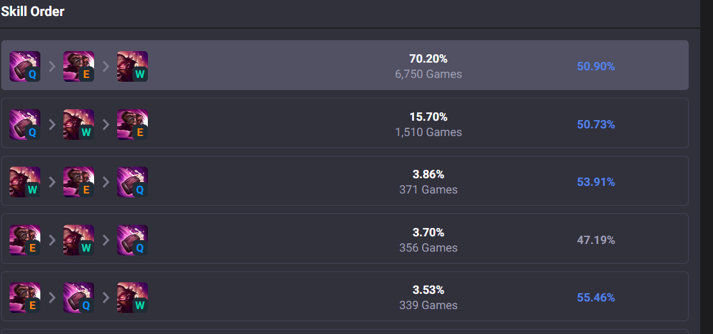

# 2月随笔

## 春节翻译问题 
舆论场上的热点像是个欠阻尼函数，最开始爆出来影响很大，全民讨论，群情激愤，在一片混乱中到了第一落点，事态全貌大致悉数清楚，各方阵营立场观点人物都有了画像，各看客也找到自己位置，逐渐拉开架势。然后第二场相关扰动（往往是看客之间的风波）紧随其后，两军对垒，互有交换，互有伤亡，战斗个三五天，一两周，又平静下来。当然此事远未结束，（只是开始的结束），各人心中种下此事的一颗种子，一株梁木，他先入为主的观念或许尚未与人交锋，此事便淡去，让与另一热点。而这种子便是为了等待此事的echo。

终于在半年后，一年后，也许是新一届学生入学，也许是又到年关岁末，也许是一张趣图再次出现，旧事重提，唤醒旧人的种子，梁木，加以新人的“新时代观点”，又一场混战在所难免。

“春节”如何翻译，“春晚”看是不看，新入学的又在担心学积分，楼下洗衣机又出现了袜子内裤，几个似曾相识的渣男渣女演着类似的桥段，哪家vtuber又毕业了，男权女权，日本美国... 两波甚或三波人论战，墙内或是墙外，文字或是视频，平民百姓或是大v网红。

这便是这一类论题的宿命，重复被讨论，重复被回答，重复被信仰，重复被遗忘，再循环往复。小的时候觉得每天都是崭新的，各种观点层出不穷，新颖角度不断提出，但这种增长不是无限的，斜率会逐渐平缓，可能某一天没有什么新想法，可能某一月重复在同样的路上，可能某一年都浑浑噩噩，可能一辈子也就碌碌无为。

如果说现代性意味着终极意义的消失，过去的单一叙事被多元取代，迎来了一个文化极大丰富的时代，但随之而来的却是虚无主义。连接多元与虚无之间的就是**重复**。现代主义许诺了我们无限的自由，但我们发现这无限仅是有限的各种排列组合。恰如每一局游戏都是独一无二的，游戏空间也是无穷范数的，但都不过是几个角色，几个技能的空间，时间排列。各个城市是建筑和人的排列，文学是语句的排列，伟大思想是更小思想的排列。终极意义的丧失否定了一座城市，一种思想的神圣性，通过比较，我们又失去了所有城市，所有思想的神圣性。当旅行者意识到每座城市的大同小异，当思想家发觉思想不过是文字游戏，他们有两条路可走。一是在该领域探寻一种**好的**元素的排列。二是陷入无意义的反思。

世界便分为两类人，一类是想要配置有限的因素使得事物变好的人，另一类是不想要配置元素，仅是观察的人。

## 春晚与流行语

在前互联网时代，春晚是全国人民少有的共同文化产品，因而成为一个最好的文化传播媒介，任何春晚的内容都被全国人民消费，尤其以语言类节目的“梗”最广为传播。而现在，没有一个全民共消费的文化产品，不同的软件，同软件的不同子社区，一个个泡泡把人群隔开，大多数“梗”仅是小圈子文化。在文化膨胀时代，春晚自然不好看了，因为它的受众不单是你，相比于你整天看的专门对口自己的内容，春晚自然显得乏味。

## 社交媒体

各国跟进限制未成年人使用社交媒体。社交媒体和游戏的危害性在于，它们的内容是近乎无限的。作为人的天性之一，我们天然对无限的东西有好奇心，也更加易于沉迷其中。这种沉迷和过去孩子沉迷武侠小说，沉迷游戏机有何不同？过去，内容创作者和渠道商是类似的，都是某种意义上受过教育的精英人群，作家与编辑，游戏开发与游戏发行商，导演和制作人，他们的目的也是最大可能的吸引受众注意力，但内容毕竟有限，还要与同行竞争，结果只能筛选出几种良好制作。现在，互联网时代的9极大发展，让加入文化创造的门槛变得极低，变成了内容创作者，平台，受众的三角关系。任何人都能写小说，剪视频，生产游戏（特制多人网络游戏），平台的目的在于分化一部分受众，养成自己的资产。在平台搭建的一个氛围下，每个个体上传自己的内容，再被其他个体消费，利用奖赏机制（点赞，评论，投币）维持长期稳定，加以人性的弱点（喜欢被关注，想要与人交往）。

## 定番
开局主角满装遇大boss，吃瘪，功法全废，从头练级

## 被两个女生说记住
之前从小红书上加了一个鹅鸭杀群组，偶尔会去和他们一起玩。断断续续玩了几次后，一次晚上结束后在房间里面聊了很久，算是介绍了自己的身份。组局的是一对初中同学（重生，鲸）加两队对高中同学（重生+强者，鲸+乳牛），再加上几对情侣。核心角色是重生和强者，两个都是女生，都是03年浙江人。组局的时间一般都在晚上11点到12点附近，我因为觉得强者的声音很好听，人也很有意思，总想着和她一起玩，可惜最近有几天没碰上，今天突然赶上了就去玩了几把，遇到强者时，她说：“孔梅溪你是不是好久没来了”。心中还是有窃喜。

另一段是三四年前，打瓦的时候关注了一个b站小主播，七之宝，也是觉得说话声音很好听，性格很有意思，虽然观众不多，但很用心，抱着观察的心态看了好一阵子。特点之一是熟人很多，弹幕多是那几个id，斩冥，seventeen，三森澪...主播的qq群里也都是那些熟人在互聊，我还加了主播的qq。后来主播把qq群解散了，只剩下kook群组，直播时间也有所变化，我也因为到了日本，有段时间没看了。最近因为她在看火影忍者，我晚上偶尔再去看她直播，发几条弹幕，意外的被主播点名有印象，还因为我的qq头像去看了空中杀手。物是人非,下次想问问之前的观众都去哪里了。

## 长期接触的人或多或少都会了解其性格特点
柴西的视频也看了五六年，七之宝也看了三四年，影视飓风，小岩雀也都看了很久，久而久之似乎把他们当成了朋友，也逐渐意识到其性格上的特点（缺陷）。柴西经常不自信，希望得到别人认可，害怕孤独，七宝时常犹豫不决，影视飓风有自卑感和表演欲，雀哥想要赚米，自视清高...现实中的朋友也一样如此。

很久之前就有一种预感，只要和任何人聊天一小时就会感觉到对方的特点（缺陷），大致是22年那一阵和很多人晚上聊天散步得到的结果，还有24年在网络聊天的感想。总觉得别人要么自大，自我中心，要么犹豫不决讨好型人格，对很多我以为的常识视若罔闻，和自己的世界观也多少有差别，一言以蔽之，能认识到和对方是两个世界的人。这当然是一件好事，很久以来我甚至害怕有人和我相似，所谓“自我厌恶”。但多多少少这种明显的认知使得我不太可能真的“相信”“接受”“理解”“同情”另一个人，最多只是带有一种俯视的“怜悯”。

看到柴西努力的视频，想着她总是刻意保持完美，精心的安排，化妆，剪辑只为得到别人的认可，也有些可怜。看七之宝，雀哥也有点共鸣的感觉，

自己又如何呢，最近的形容词是**懒狗**。

## chinamaxing
bbc出了一个介绍chinamaxing的视频[Chinamaxxing: The viral trend about ‘being Chinese’ ](https://www.youtube.com/watch?v=EMNj5Q-4Gsg&t=3s)，是在令人吃惊，“成为中国人”居然真的是一个西方流行的话题。特点一是以美国年轻网络用户为核心的trend，顺便波及了一些相近的英文文化圈，没有涉及日韩东南亚。特点二是仍作为刻板印象存在，以一些典型例子作为“中国化”代表，例如喝热水，吃热食，练太极...明显带有一种“异域情调”exotic，也因而更了解中国的亚洲群体没有明显反应。

好消息是这次的china trend有着较为褒义的传播，不同于covid或是更早的china形象，这或许是第一次中国文化正面的形象大规模传播，并带有了一种“反叛美国当前文化”的含义。中国实实在在提出了一种不同于西方的新道路，今年的开放政策也逐渐将其推广开来，中国的影响力正逐渐匹配其实力，可以预计未来会达到一致，其副产物会是对中国内部的改善，更容易融入全球社会，更紧密加入世界体系，（更适应中国的体系）。所以我还是保有“未来会变得更好”的观点。1.中国会继续发展 2.发展会增大与全球的联系 3.这是不可逆的。目前中国人看世界，世界看中国都有不透明的滤镜，但下一代人，后习近平时代，都会逐步褪去这层滤镜，在一个合适的伟大的时间，防火墙将会消失，新的国际秩序是中国深度参与的样子。

这样的基本论点清晰可见，只要认识到这一点，大多数“反贼”言论不攻自破，就像男女终将平权，世界将会变成一体一样，未来的目标是明确的。

当然例外是ai。

## [2025年度梗盘点](https://www.bilibili.com/video/BV1rPZJBeE9N/)

时间列车不停留，还好我们有互联网史官，虽说重复是后现代的宿命，但多少还是有些新的排列组合令人眼目一新，甚至从未想到的元素在发明。很久没有看水源趣图楼了，似乎不少梗有点跟不上了。

## 2026总台春晚

每年看春晚仍然是不可或缺的节目，全年的大多数时间内都是独自欣赏文化内容，有一个不错的机会可以和中文圈的不少人一起同时看一个文化产品的机会还是相当稀有的，尤其今年也有王菲独唱，更是不可不看。也算是看了10多年春晚了，现在来看，春晚不仅是一个文艺晚会，是一个商业表演，还是一个政治任务。

春晚诞生之初也只是北京文艺界，或说中央电视台内部庆祝新年的一个文艺晚会，歌舞，表演，戏曲，主持都是现成的，各部门搜集一下人就齐了。后来越办越大，人越来越多，吸收了社会上的各种元素，随着时

对于春晚的印象，小时是乏味的歌舞类和有趣的语言类，大学时则更多关注歌舞的漂亮姐姐和每年的热门歌手，今天的注意点是广告。语言类节目的衰弱我想一是老艺术的缺席，二是更肃杀的政治氛围，三是日常文化产品的比较。相比于以前纯粹是为了春节欢乐所做的春晚，如今的春晚更接近于一个政治任务，受到更多的关注，期待和审查。从一个电视台内部的娱乐活动逐渐发展成一个举国瞩目的盛典，而与此同时又没有相应的国家补助和重视程度。且从春晚诞生之日起，就依赖于社会资金支持，广告收入成为春晚的最大支持。从传统酒业到新兴互联网巨头，到如今ai机器人新贵，登上春晚舞台一是本身有足够现金，二是企业本身也符合当前的时代潮流。

当然商业化，企业化也没有任何问题，全面向“超级碗”“NBA”看起也是不错的选择，但在商业形式之下，又有一层政治底色，

## 少数群体易被关注 上新闻引热度
任何新闻选择容易找少数群体来凸显一种包容性，甄嬛传的台湾热视频选择了男同群体为例子。我实在不知道为什么要特意选择男同群体和这个毫无关联的题目，但这确实会吸引更多眼球，带着猎奇，趣味的眼光。

## 我是一个大众的人
作为一个下棋绝对相信大数据的人，作为每年必看春晚的人，作为欣赏一切主流文化产品的人（电影 音乐 书记 动漫 游戏...），，作为善于考试的人，我应该是一个大众的人。

## 看到编排的东西会生理不适 
看到非常尴尬的事情会生理不适，完全看不下去。

小学时偶尔有“公开课”，需要选一个“优秀”班级，选30“优秀”学生，额外去到多媒体教室，那里有白板窗帘，再编排内容，预先演练，最后演给视察领导。对领导，教师而言，是一种形式主义，官僚作风，对于学生而言倒还算有趣好玩，放在整体上看又有些正面价值，起到了一种巡察组的作用，也交流了各校各县城的教学经验。中学时有集体春游，高中时有集体向烈士陵园献花，现在看来都是宣传口的“照片任务”，但对当时的学生而言在乏味的日常生活中确实新鲜有趣，到了大学的团支部团建则令人厌烦。

但这些“形式主义”倒也不是不好，毕竟我们生活在这个世界上就会有形式存在，并且其也是好用的，大多情况下是节省时间的。我更“反感”的是那种

## [湖同样是景点](https://www.youtube.com/watch?v=PJeveTaWBQw)
资本主义，旅游景点，消费主义当然是失真的，但若以为跋山涉水就能寻得一处世外桃源，香格里拉，无人知晓的自然风光也是妄想。因为有路，因为有人迹，可到达的地方绝不会是自然本然，无论是被包装的景点，还是乡间小路，无非被人类活动渗透程度大小问题，就如同“本地人餐馆”本身作为一个旅游噱头而不那么本地。有点像是被观察的一刻就赋予了其额外的“被观察”属性。

## 珈乐猜想
510事件事到如今仍然是一个迷，资本方决定将33踢出asoul，33事先在网易云埋下雷，剩余四人有不同观点，粉丝选择相信不同观点，以及后续的狗血发展，时代落幕后，asoul三人正常继续，33，向晚也有自己的前途，在当下似乎才能理性的看待全局。

我将其归结为“珈乐猜想”，也就是“企业势vtuber火了是企业功劳大还是中之人功劳大”。也就是典型的平台和个人的问题。首先在发展到510的那个时间点时，个人的话语权应该是相当被低估的，从后果来看，33出走是asoul崩盘的绝对导火索，如若不走，至少再活个一年，五个生日会，五个万舰和相关工商，asoul在落幕前可以获得的利益是巨大的，仅算数字的话的确33有资格要求更好的薪资和待遇，资方也不该草率的开掉她。然而站在资方角度，asoul能火，能有万舰级别的热度，主要的贡献在于资本，我很早就说过嘉然带四个任意女大学生都能出圈，甚至没有嘉然也有可能。事实上除了嘉然，其他四个人都是在吸血，其他四个人都要看嘉然的脸色，对嘉然感恩戴德，而嘉然的“成功”也离不开企业的其他普通员工，就像星瞳知道自己只是在扮演一个角色，只是个上班的普通人，asoul并不可以类比乐华旗下的其他明星艺人，因为asoul企划本身也只不过是实验性质。

## 小怪兽训练师悖论
s15格斗大赛有一个奕子璐璐，可以选择三种不同形态的小怪兽上场，独特机制是经验机制，每回合会增加一个独立计算的经验，升到30级有特殊强化。因而导致的一个结果是必须野怪爆了一张璐璐才会选择这个阵容。也就是不胡不玩。很多阵容是8级随时可以转的通用阵容，不需要特定的过渡，不需要特定的海克斯，只要一些经济和关键装备就能迫降，例如艾欧，冰皮，有些需要基础卡质量，也就是要有配套过渡，如德玛，虚空。还有一类如比尔，佛爷，小怪兽，大家默认必须开局2-1能开出三比，两暗影岛，爆璐璐才能完的阵容，即使设计师想要让其能在一般的情况下玩，但大多数玩家仍然把他看成2-1才能选择的分支路线，如果1-4没有卡片，没有两星佛爷就没有那两条路。于是设计师陷入了一个想加强让其不再限定2-1才能完，但发现即使加强了大家还是2-1胡了才玩。

## [捂鼻子有问题吗](https://x.com/isfjmocha/status/2024155381543346550)

## 剪辑配音剧情
拍视频的人本身有想要表达的内容，

## 大陆要比绝大多数地方更有城市化特征
虽然西方国家，日韩港台比大陆更早城市化，甚至早了100年，但得益于大体量和最晚一批城市化的优势，大陆在很多地方有着更鲜明的城市化现代化特征，并迈入了后现代趋势。

应当认识到西方和中国的绝对不同。

## 万达广场附近有吗
非常聪明的钓鱼手段，一模糊了具体地点，只讲了一个大概，二模糊了具体事件，引发观看者联想，非常符合一种“筛选”的效率，被钓上的人大多“自我幻想”

## 智识 性格 理智
过年当晚和高中同学一起打了通宵的大乱斗，中间一把玩了肉酒桶，提出了“肉酒桶该主w还是e”的问题，我当然知道传统而言肉酒桶是主w的，因为w有减伤，但细想了一下酒桶主要的连招是we二连，e的cd比w长，类比妖姬连招wqe的wcd更长所以主w，我预计主e并不会差。而钟xl并不认为这是一个值得讨论的题目，坚持只有主w唯一解，王xh也随之附和，攻击主e是奇思怪想，小众哥。但我在比较w升级和e升级的属性后，愈发觉得主e是一个可选项，并坚持己见。随着他们的持续指责，打完一把后去查了opgg大数据，显示无论大乱斗还是峡谷上单，除了主q的加点，主e的都多于w。

将截图发至qq群里后，以为讨论以及告一段落，然钟仍然不认为错了，不依不饶辩解主w才是唯一答案。事实上我并不是讨论哪个加点是唯一正确的，我只是讨论一下各种加点的优劣，个人喜欢主w主e自可自行其是，但钟应激似的反对和滚刀肉的态度惹恼了我，也让我有些失望。

后来总结这场“争论”，一是智识上的差距，虽然我也有主w的先入为主影响，但靠着推论，自发地得出了主e不会差的结论，而钟或王都没有看到这一点。二是性格的差距，我并非抱着自以为真理的心态去争论，只是提出一个新的讨论，他们则着急的证明别人的错误，听不进任何不同的声音。三是理智的差距，当大数据摆在面前时，有理智的人都应该承认主e并不是小众的臆想，而是实打实的优秀答案。但面对错误死不承认，倒打一耙，完完全全在理智上令人失望。

## 中国未必能赶上如今的文化战争
看了Netflix原创的*KPop Demon Hunters*，很可以与*超かぐや姫！* 比较一下，同样是 Netflix原创，分别是日韩流行元素的堆叠，都套用了一个传统的故事在近未来的改编，内核都是简单的俗套剧情，都是优秀的院线电影，都有短视频时代的特点，都算是音乐剧，都有非常多网络meme...2025年Netflix大笔收购华纳的同时又退出两部原创东亚文化的动漫电影，可见其野心之大，布局之广，互联网公司的特点就是知道什么内容值钱，看到这两部电影在国内外的超强影响力也触动了我对于“流行”文化的理解以及对未来文化产品发展方向的认知。总之这是一个非常有讨论价值的趋势，而且我们处在其中。

另外一个值得讨论的点是两部动画在国内和国外的不同反应，在国内超时空辉夜姬热度显然比kpdm高很多，而国外kpdm热度则显著的更高，甚至在日本的评论网站kpdm热度也比辉夜姬高。则体现了其本质分属不同文化类别的表现，辉夜姬本质是一部二次元动漫作品，其讨论圈层集中在二次元爱好者，otaku，/anime，国内已经发展了一个庞大群体（或许是全球最大），对于任何新番都会积极讨论。而kpdm则更像是一部迪士尼式的美国动画，套着一个kpop的皮，内部的叙事结构和核心价值都还是美式价值观。国内对于此类文化产品则没有那么热情，至少在b站（中国年轻人群体）知乎都没有什么热度。而海外则反过来，日本二次元文化虽也逐渐扩展影响力，但仍是小众圈里自萌，美国文化还是占据主导地位，顺带着长期耕耘西方市场的kpop流行元素，以及制作精良的画面与音乐，在西方更容易获得全民的关注度（很神奇的居然在日本也是如此）。（kpdm甚至没有出现在myanime评分网站中）

它们都是短视频时代的文化产品，即使是电影的长度，也仍需要即时的短的连续的视觉刺激。但两部侧重点又有所不同，kpdm总时长更短（100分钟），剧情更简单，分段更清晰，理解门槛更低，视觉听觉感官刺激更直接，辉夜姬则更贴切“炫技”“量大管饱”“审美疲劳”的描述，偶尔会让人想到*孤独摇滚* 的风格，但作为一部142分钟的长片，其有较为严重的叙事缺陷，不连贯，不清晰，不完整，结尾莫名其妙，主题不明不白（对于一部小而美的产品是好的，对于院线电影则不会全年龄喜欢）。其中流行文化的使用含有共同性，如vr直播，游戏，kpop，TikTok，萌元素，都是符合当下日韩年轻人潮流的文化。几首出圈的歌曲旋律洗脑，歌词朗朗上口，也是工业化的产物，很符合“小品”的性质。

## 反战败 和 反战
一个常见的对于日本反思二战的批评在于“日本反战败而不反战”，